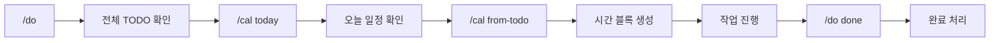

---
tags:
  - type/guide
  - topic/productivity
  - topic/ai
---

# Claude Code로 TODO + 스케줄 관리하기

> Claude를 일정/TODO 관리 전문가로 활용

## 개요

프로젝트별 TODO를 옵시디언에서 관리하고, Apple Calendar와 연동하여 시간 블록을 자동 생성하는 워크플로우.

## 핵심 도구

| 커맨드 | 용도 |
|--------|------|
| `/do` | TODO 조회/추가/완료 |
| `/cal` | 캘린더 조회/추가/삭제 |
| `/cal from-todo` | TODO 기반 스케줄 자동 생성 |

## 플로우



## TODO 관리 (`/do`)

### 원칙

- **TODO는 각 프로젝트 `_CONTEXT.md`에서 관리**
- `_TODO.md`는 tasks 쿼리로 자동 수집 (직접 편집 X)
- 일상/습관만 `AREA_TODO/DAILY.md`에서 관리

### 사용법

```bash
/do                     # 전체 TODO 조회 (프로젝트별)
/do 업무                # 업무 프로젝트만
/do 개인                # 개인 프로젝트만
/do add MY-APP 버그수정 # 특정 프로젝트에 TODO 추가
/do done MY-APP 버그수정 # 완료 처리
/do habits              # 습관 조회
```

### 출력 예시

```
📋 프로젝트 TODO
━━━━━━━━━━━━━━━━━━━━━━━━━━━━━━
[업무] MY-PROJECT
  □ API 문서 작성
  □ 버그 수정 (로그인 이슈)

[개인] SIDE-PROJECT
  □ MVP 기능 구현
  □ 테스트 코드 작성

🎯 오늘의 습관:
  □ 영어 공부 30분
━━━━━━━━━━━━━━━━━━━━━━━━━━━━━━
```

## 캘린더 관리 (`/cal`)

> 상세: [[CALENDAR-GUIDE]]

### 사용법

```bash
/cal                    # 오늘 일정 조회
/cal week               # 이번 주 일정
/cal add 업무 "회의" 14:00 15:00   # 일정 추가
/cal delete "회의"      # 일정 삭제
```

## TODO → 스케줄 변환 (`/cal from-todo`)

가장 강력한 기능. Claude가 TODO 목록을 분석해서 시간 블록을 제안.

### 실행

```
/cal from-todo
```

### 동작

1. 현재 세션의 TODO 목록 확인
2. 우선순위와 예상 소요 시간 분석
3. 시간 블록 제안
4. 사용자 확인 후 캘린더에 등록

```
→ 오늘 TODO:
  - PR 코드 리뷰
  - API 문서 작성
  - 버그 수정 (로그인 이슈)

→ 제안 스케줄:
  13:00-13:30 PR 코드 리뷰
  13:30-15:30 API 문서 작성
  15:30-17:30 버그 수정 (로그인 이슈)

→ 이대로 등록할까요?
```

## 시간 블록 원칙

| 구분 | 시간 | 캘린더 |
|------|------|--------|
| 업무 | 10:30-22:30 | 업무 |
| 개인 | 출퇴근 외, 주말 | 개인 |
| 딥워크 | 2-3시간 연속 | - |
| 버퍼 | 예상의 20% 추가 | - |

## 우선순위 기준

| 순위 | 기준 |
|------|------|
| P0 | 오늘 마감, 블로커 |
| P1 | 이번 주 마감, 의존성 있음 |
| P2 | 중요하지만 급하지 않음 |
| P3 | 언제든 가능 |

## 폴더 구조

```
옵시디언/
├── 업무/
│   └── PROJECT_*/
│       └── _CONTEXT.md    # ## TODO 섹션
├── 개인/
│   ├── PROJECT_*/
│   │   └── _CONTEXT.md    # ## TODO 섹션
│   └── AREA_TODO/
│       ├── DAILY.md       # 일상 할일
│       ├── HABITS.md      # 습관 트래커
│       └── INBOX.md       # 임시 수집함
└── _TODO.md               # tasks 쿼리 (자동 수집)
```

## 설정 파일

```
~/.dotfiles/claude/
├── commands/
│   ├── do.md              # /do 커맨드
│   └── cal.md             # /cal 커맨드
├── scripts/
│   └── cal.sh             # AppleScript 래퍼
└── skills/
    └── calendar/
        └── README.md      # 캘린더 스킬 가이드
```

## 옵시디언 Tasks 플러그인 연동

마감일, 예정일 등 메타데이터 지원:

```markdown
- [ ] API 문서 작성 📅 2026-01-10
- [ ] 코드 리뷰 ⏳ 2026-01-07
- [x] 버그 수정 ✅ 2026-01-06
```

| 이모지 | 의미 |
|--------|------|
| 📅 | 마감일 (due) |
| ⏳ | 예정일 (scheduled) |
| ✅ | 완료일 (done) |
| 🔁 | 반복 (recurrence) |

## 빠른 시작

```bash
# 1. 오늘 할 일 확인
/do

# 2. 오늘 일정 확인
/cal today

# 3. TODO 기반 스케줄 생성
/cal from-todo

# 4. 작업 완료 후
/do done MY-PROJECT "API 문서 작성"
```

---

#project/dev-setup #topic/productivity #type/guide
