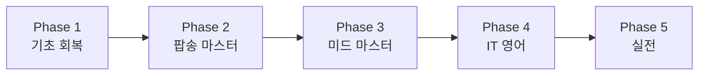
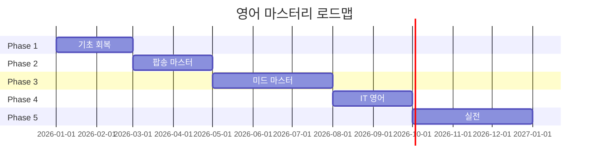

# 영어 마스터리 커리큘럼

> 목표: 외국 IT 기업 취업 수준
> 일일 학습 시간: 30분 이하 (자투리 시간 활용)
> 작성일: 2026-01-04

## 학습 로드맵

---

## Phase 1: 기초 회복 (8주)

> 목표: 토익 900점대 감각 회복, 영어 뇌 깨우기

### 일일 루틴 (25-30분)

| 시간 | 활동 | 도구 |
|------|------|------|
| 출근길 10분 | 팝송 1곡 반복 청취 | Spotify/Apple Music |
| 점심 10분 | 단어 20개 복습 | Anki/Quizlet |
| 퇴근길 10분 | 같은 팝송 가사 보며 듣기 | Genius 앱 |

### 주간 목표
- [ ] 토익 단어 140개/주 복습
- [ ] 팝송 1곡 가사 암기
- [ ] 주말: 30분 집중 리스닝

### 시작 팝송 (Coldplay/Imagine Dragons)
1. **Yellow** - Coldplay (느린 템포, 명확한 발음)
2. **Fix You** - Coldplay (감성적, 반복 구간 많음)
3. **Demons** - Imagine Dragons (스토리텔링)
4. **Believer** - Imagine Dragons (강렬, 발음 연습)

### 체크포인트
- [ ] 4주차: Yellow 가사 100% 청취
- [ ] 8주차: 팝송 2곡 따라 부르기 가능

---

## Phase 2: 팝송 마스터 (8주)

> 목표: 팝송 5곡 완벽 청취 & 따라 부르기

### 일일 루틴 (25-30분)

| 시간 | 활동 | 방법 |
|------|------|------|
| 출근길 | 새 곡 청취 | 가사 없이 먼저 |
| 점심 | 가사 확인 & 모르는 표현 정리 | Notion/메모 |
| 퇴근길 | 섀도잉 (따라 말하기) | 이어폰 한쪽만 |

### 추가 팝송 리스트
5. **Viva La Vida** - Coldplay (역사적 표현)
6. **Radioactive** - Imagine Dragons (강한 발음)
7. **The Scientist** - Coldplay (감정 표현)
8. **Thunder** - Imagine Dragons (리듬감)
9. **Paradise** - Coldplay (스토리)
10. **Whatever It Takes** - Imagine Dragons (동기부여)

### 학습 방법
1. **1일차**: 가사 없이 3회 청취 (뭐라고 하는지 추측)
2. **2-3일차**: 가사 보며 청취 (모르는 단어 체크)
3. **4-5일차**: 따라 부르기 (발음 집중)
4. **6-7일차**: 가사 없이 따라 부르기

### 체크포인트
- [ ] 4주차: 5곡 가사 80% 청취
- [ ] 8주차: 5곡 자신있게 따라 부르기

---

## Phase 3: 미드 마스터 (12주)

> 목표: **Designated Survivor 시즌 1** 자막 없이 70% 이해

### 왜 Designated Survivor?
- 정치 드라마: 격식체/비격식체 모두 등장
- 명확한 발음: 대통령/정치인 캐릭터
- 긴장감: 몰입도 높아 반복 시청 용이

### 3단계 시청법

**Step 1: 한글 자막 (1-8화)**
- 스토리 파악, 재미에 집중
- 자주 나오는 표현 메모

**Step 2: 영어 자막 (1-8화 재시청 + 9-16화)**
- 들리는 대로 읽으며 확인
- 모르는 표현 정리

**Step 3: 자막 없이 (1-8화 3회차 + 17-21화)**
- 이해 안 되면 되감기
- 70% 이상 이해 목표

### 일일 루틴 (30분)

| 요일 | 활동 |
|------|------|
| 평일 | 1에피소드 절반 (20분) + 표현 정리 (10분) |
| 주말 | 1에피소드 전체 + 복습 |

### 핵심 표현 카테고리
- 정치/외교 표현
- 위기 상황 표현
- 가족/인간관계 표현

### 체크포인트
- [ ] 4주차: Step 1 완료, 주요 캐릭터 대사 패턴 파악
- [ ] 8주차: Step 2 완료, 영어 자막으로 90% 이해
- [ ] 12주차: Step 3 완료, 자막 없이 70% 이해

---

## Phase 4: IT 영어 (8주)

> 목표: 기술 문서 빠르게 읽기, 영어 미팅 참여 가능

### 일일 루틴

| 시간 | 활동 | 자료 |
|------|------|------|
| 출근길 | Tech 팟캐스트 청취 | Syntax, JS Party |
| 점심 | 영어 기술 블로그 1개 | Dev.to, Medium |
| 퇴근길 | IT 표현 복습 | 정리 노트 |

### 추천 자료

**팟캐스트 (리스닝)**
- Syntax (웹 개발, 친근한 톤)
- JS Party (자바스크립트)
- Software Engineering Daily (다양한 주제)

**유튜브 (시각+청각)**
- Fireship (빠른 설명, 트렌드)
- Theo - t3.gg (심도 있는 토론)
- ThePrimeagen (재미있는 코딩)

**읽기 자료**
- Hacker News (매일 헤드라인)
- Dev.to (쉬운 영어)
- 공식 문서 (MDN, React Docs)

### IT 필수 표현
- 코드 리뷰 표현
- PR/이슈 작성
- 미팅 표현 (동의/반대/제안)

### 체크포인트
- [ ] 4주차: 팟캐스트 70% 이해
- [ ] 8주차: 영어로 PR 코멘트 작성 가능

---

## Phase 5: 실전 (지속)

> 목표: 외국 IT 기업 인터뷰 가능

### 활동

**스피킹 연습**
- AI 영어 회화 (ChatGPT Voice, Speak 앱)
- 혼잣말 영어로 하기
- 기술 설명 영어로 녹음

**모의 인터뷰**
- Behavioral 질문 준비
- Technical 질문 영어로 설명
- 실제 외국 기업 지원

### 체크포인트
- [ ] 자기소개 2분 영어로
- [ ] 기술 스택 설명 영어로
- [ ] 모의 인터뷰 3회 이상

---

## 전체 타임라인

| Phase | 기간 | 핵심 목표 |
|-------|------|-----------|
| 1. 기초 회복 | 1-2월 | 토익 감각 회복, 팝송 2곡 |
| 2. 팝송 마스터 | 3-4월 | 팝송 5곡 완벽 |
| 3. 미드 마스터 | 5-7월 | Designated Survivor 자막 없이 |
| 4. IT 영어 | 8-9월 | 기술 팟캐스트/문서 |
| 5. 실전 | 10-12월 | 인터뷰 준비 |

---

## 도구 & 앱

| 용도 | 추천 |
|------|------|
| 단어 암기 | Anki, Quizlet |
| 팝송 가사 | Genius, Musixmatch |
| 팟캐스트 | Pocket Casts, Spotify |
| 스피킹 | Speak, ELSA |
| 기록 | 옵시디언 (이 문서!) |

---

## 동기부여

> "영어는 마라톤이다. 매일 30분, 1년이면 180시간."

- 하루 30분 × 365일 = **182.5시간**
- 꾸준함이 실력이다
- 좋아하는 콘텐츠로 즐기면서!

---

#project/english #type/curriculum #status/active
