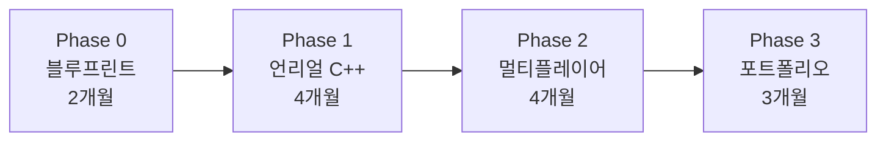

# 언리얼 엔진 게임 개발 커리큘럼

> 작성: 2026-01-04
> 조건: C++ 입문자, 주 5시간, 친구(사운드 디자이너)와 협업

---

## 전체 로드맵 (12~15개월)



| Phase | 기간 | 누적 시간 | 목표 |
|-------|------|-----------|------|
| 0 | 2개월 | ~40h | 블루프린트로 첫 게임, 친구와 협업 시작 |
| 1 | 4개월 | ~120h | 언리얼 C++ 기초, 게임플레이 구현 |
| 2 | 4개월 | ~200h | 멀티플레이어, 네트워크 동기화 |
| 3 | 3개월 | ~260h | 포트폴리오 프로젝트 완성 |

---

## Phase 0: 언리얼 블루프린트 (2개월)

> 목표: 코딩 없이 첫 게임 완성, 친구와 협업 구조 만들기

### Month 1: 언리얼 입문

**Week 1-2: 환경 설정**
- [ ] Epic Games Launcher 설치
- [ ] Unreal Engine 5 설치
- [ ] 첫 프로젝트 생성 (Third Person 템플릿)
- [ ] 에디터 UI 익히기
- [ ] 🎯 **실습**: 템플릿 캐릭터 조작해보기

**Week 3-4: 블루프린트 기초**
- [ ] 블루프린트 노드 개념
- [ ] 변수, 이벤트, 함수
- [ ] 간단한 상호작용 (문 열기)
- [ ] 🎯 **프로젝트**: 방 탈출 미니게임

**학습 자료**
- [공식 튜토리얼](https://dev.epicgames.com/community/unreal-engine/learning) (무료)
- YouTube: "Unreal Engine 5 Beginner Tutorial"

### Month 2: 첫 게임 완성

**Week 1-2: 게임 메카닉**
- [ ] 캐릭터 이동, 점프
- [ ] 아이템 수집
- [ ] UI (체력바, 점수)
- [ ] 🎯 **실습**: 코인 수집 게임

**Week 3-4: 친구와 첫 협업**
- [ ] Git + Git LFS 설정 (언리얼용)
- [ ] 프로젝트 공유
- [ ] 친구가 사운드 넣을 수 있게 구조 설명
- [ ] 🎯 **프로젝트**: 사운드 포함된 미니게임 완성

### Phase 0 완료 기준

- [ ] 블루프린트로 간단한 게임 만들기 가능
- [ ] 친구와 프로젝트 공유/협업 가능
- [ ] 언리얼 에디터 기본 조작 익숙

---

## Phase 1: 언리얼 C++ (4개월)

> 목표: 블루프린트 + C++ 혼합, 게임플레이 프로그래밍

### Month 3: C++ 기초 + 언리얼 연동

**Week 1-2: C++ 최소 문법**
- [ ] 변수, 함수, 클래스 기초
- [ ] 포인터 개념 (간단히)
- [ ] 🎯 **실습**: 간단한 C++ 콘솔 프로그램

**Week 3-4: 언리얼 C++ 시작**
- [ ] C++ 클래스 생성
- [ ] UCLASS, UPROPERTY, UFUNCTION 매크로
- [ ] 블루프린트에서 C++ 호출
- [ ] 🎯 **실습**: C++로 Health 컴포넌트 만들기

**학습 자료**
- [learncpp.com](https://www.learncpp.com/) Chapter 1-5 (기초만)
- [Unreal C++ 공식 문서](https://docs.unrealengine.com/5.0/en-US/programming-with-cplusplus-in-unreal-engine/)

### Month 4: Actor와 Component

**Week 1-2: Actor 시스템**
- [ ] AActor 상속
- [ ] 컴포넌트 구조
- [ ] BeginPlay, Tick
- [ ] 🎯 **실습**: C++로 회전하는 아이템 액터

**Week 3-4: 입력과 이동**
- [ ] Enhanced Input System
- [ ] Character Movement Component
- [ ] 🎯 **프로젝트**: C++ 캐릭터 이동 구현

### Month 5: 게임플레이 시스템

**Week 1-2: 충돌과 데미지**
- [ ] 콜리전, 오버랩 이벤트
- [ ] 데미지 시스템 (ApplyDamage)
- [ ] 🎯 **실습**: 적 캐릭터 + 공격 시스템

**Week 3-4: 게임 모드**
- [ ] AGameModeBase
- [ ] AGameStateBase
- [ ] APlayerController
- [ ] 🎯 **프로젝트**: 웨이브 서바이벌 프로토타입

### Month 6: UI와 폴리싱

**Week 1-2: UMG (UI)**
- [ ] Widget Blueprint
- [ ] C++에서 UI 연동
- [ ] 🎯 **실습**: 메인 메뉴, HUD

**Week 3-4: 친구와 게임 완성**
- [ ] 사운드 통합
- [ ] 이펙트 추가
- [ ] 🎯 **프로젝트**: 싱글플레이어 게임 v1 완성

### Phase 1 완료 기준

- [ ] C++ 클래스 작성 가능
- [ ] 블루프린트 + C++ 혼합 사용
- [ ] 친구와 함께 싱글플레이어 게임 완성

---

## Phase 2: 멀티플레이어 (4개월)

> 목표: 친구와 같이 플레이할 수 있는 게임 만들기

### Month 7: 네트워크 기초

**Week 1-2: 언리얼 네트워크 개념**
- [ ] 서버-클라이언트 모델
- [ ] Authority (권한)
- [ ] 로컬 테스트 (PIE 멀티플레이어)
- [ ] 🎯 **실습**: 2인 접속 테스트

**Week 3-4: Replication 기초**
- [ ] UPROPERTY(Replicated)
- [ ] GetLifetimeReplicatedProps
- [ ] OnRep_ 콜백
- [ ] 🎯 **실습**: 위치 동기화

**학습 자료**
- [Unreal Networking Overview](https://docs.unrealengine.com/5.0/en-US/networking-overview-for-unreal-engine/)
- YouTube: "Unreal Engine Multiplayer Tutorial"

### Month 8: RPC와 동기화

**Week 1-2: RPC (원격 호출)**
- [ ] Server RPC (클라 → 서버)
- [ ] Client RPC (서버 → 클라)
- [ ] Multicast RPC (서버 → 모든 클라)
- [ ] 🎯 **실습**: 채팅 시스템

**Week 3-4: 상태 동기화**
- [ ] 체력, 점수 동기화
- [ ] 인벤토리 동기화
- [ ] 🎯 **프로젝트**: Co-op 슈터 프로토타입

### Month 9: 게임 세션

**Week 1-2: 세션 관리**
- [ ] 세션 생성/참가
- [ ] Steam/EOS 연동 개념
- [ ] 🎯 **실습**: LAN 매치

**Week 3-4: 게임 모드 (멀티)**
- [ ] 팀 시스템
- [ ] 스폰 시스템
- [ ] 🎯 **프로젝트**: 2인 Co-op 게임

### Month 10: Dedicated Server

**Week 1-2: 전용 서버**
- [ ] 서버 빌드 설정
- [ ] 헤드리스 서버
- [ ] 🎯 **실습**: 로컬 전용 서버 실행

**Week 3-4: 서버 로직**
- [ ] 서버에서만 실행되는 로직
- [ ] 치트 방지 기본
- [ ] 🎯 **프로젝트**: 친구와 전용 서버로 플레이

### Phase 2 완료 기준

- [ ] Replication, RPC 이해
- [ ] 2인 이상 멀티플레이어 게임 구현
- [ ] Dedicated Server 빌드/실행 가능

---

## Phase 3: 포트폴리오 (3개월)

> 목표: 취업용 포트폴리오 + 친구와 게임 완성

### 프로젝트 옵션

#### Option A: Co-op 게임 (친구와 함께)

```
장르: 2인 Co-op 액션/서바이벌
기술:
- Unreal Engine 5 + C++
- Dedicated Server
- 사운드 시스템 (친구 담당)

기능:
- 2인 협동 플레이
- 웨이브 서바이벌 또는 던전 탐험
- 캐릭터 성장/아이템
```

#### Option B: 소규모 멀티플레이어

```
장르: 4인 대전 또는 Co-op
기술: 위와 동일

기능:
- 매치메이킹 (간단)
- 랭킹 시스템
- 로비
```

### 월별 계획

#### Month 11: 설계 + 핵심 기능
- [ ] 게임 컨셉 확정 (친구와 논의)
- [ ] 핵심 메카닉 구현
- [ ] 네트워크 구조 설계
- [ ] 🎯 Playable 프로토타입

#### Month 12: 컨텐츠 + 폴리싱
- [ ] 레벨/스테이지 제작
- [ ] 사운드 통합 (친구)
- [ ] UI/UX 개선
- [ ] 🎯 Alpha 버전

#### Month 13: 완성 + 문서화
- [ ] 버그 수정
- [ ] 최적화
- [ ] README, 기술 문서
- [ ] 🎯 포트폴리오 완성

### 포트폴리오 구성

```
GitHub Repository
├── README.md (프로젝트 소개, 스크린샷, 영상)
├── 기술 문서 (아키텍처, 네트워크 구조)
├── 소스 코드
└── 빌드 파일
```

---

## 주간 학습 패턴 (5시간)

```
평일 (3시간)
├── 월: 이론/영상 (30분)
├── 화: 이론/영상 (30분)
├── 수: 실습 (1시간)
└── 목: 실습 (1시간)

주말 (2시간)
└── 토: 프로젝트 작업 (2시간) - 가능하면 친구와 함께
```

### 친구와 협업 팁

1. **주 1회 싱크업**: 토요일에 30분 통화로 진행 상황 공유
2. **역할 분담**: 나는 프로그래밍, 친구는 사운드
3. **Git 사용**: 충돌 방지, 버전 관리
4. **작은 마일스톤**: 2주마다 플레이 가능한 빌드

---

## 체크포인트

| 시점 | 체크리스트 |
|------|-----------|
| 2개월 | 블루프린트 게임 완성, 친구와 첫 협업 |
| 4개월 | C++ 기초, 캐릭터/아이템 구현 |
| 6개월 | 싱글플레이어 게임 v1 완성 |
| 8개월 | 멀티플레이어 기초, 2인 접속 |
| 10개월 | Co-op 게임 프로토타입 |
| 12-13개월 | 포트폴리오 프로젝트 완성 |

---

## 학습 자료

### Phase 0: 블루프린트
- 🎬 [Unreal Sensei - UE5 Beginner](https://www.youtube.com/c/UnrealSensei) (무료)
- 📖 [공식 온라인 러닝](https://dev.epicgames.com/community/unreal-engine/learning)

### Phase 1: 언리얼 C++
- 🎬 Udemy: "Unreal Engine 5 C++ Developer" (유료, 추천)
- 📖 [learncpp.com](https://www.learncpp.com/) Chapter 1-8
- 📖 [Unreal C++ 공식 문서](https://docs.unrealengine.com/5.0/en-US/programming-with-cplusplus-in-unreal-engine/)

### Phase 2: 멀티플레이어
- 🎬 Udemy: "Unreal Multiplayer Master" (유료, 추천)
- 📖 [Network Compendium](https://cedric-neukirchen.net/docs/category/multiplayer-network-compendium) (무료)
- 🎬 YouTube: "Replication Graph" 관련 영상

### 전체
- 🌐 [Unreal Engine 포럼](https://forums.unrealengine.com/)
- 🌐 [Unreal Slackers Discord](https://discord.gg/unreal-slackers)

---

## 취업 준비 보충 (선택)

> Phase 3 이후, 취업 준비 시 필요하면 추가 학습

### 순수 C++ 보충 (2-3개월)

언리얼 C++만으로 부족할 경우:
- Modern C++ (스마트 포인터, STL)
- Boost.Asio 기초
- 자료구조/알고리즘

### 타겟 회사

| 회사 | 기술 스택 | 이 커리큘럼으로 |
|------|----------|----------------|
| 크래프톤 | Unreal C++ | ✅ 적합 |
| 스마일게이트 | Unreal C++ | ✅ 적합 |
| 넥슨 | 순수 C++ | ⚠️ 보충 필요 |
| 엔씨 | 자체 엔진 | ⚠️ 보충 필요 |

---

## 관련 문서

- [[_CONTEXT|현재 진행 상황]]
- [[자료/AREA_커리어/CAREER-ROADMAP-GAMESERVER-CPP|순수 C++ 로드맵]] (참고용)

---

#project/gamedev #type/curriculum #status/active
