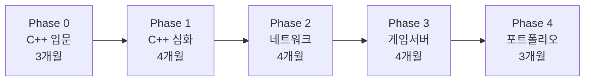

# C++ 게임 서버 개발 커리큘럼

> 작성: 2026-01-04
> 조건: C++ 입문자, 주 5시간, 프로젝트 기반

---

## 전체 로드맵 (18~24개월)



| Phase | 기간 | 누적 시간 | 목표 |
|-------|------|-----------|------|
| 0 | 3개월 | ~60h | C++ 기본 문법, 첫 프로그램 |
| 1 | 4개월 | ~140h | Modern C++, 자료구조 구현 |
| 2 | 4개월 | ~220h | TCP/UDP, 간단한 서버 |
| 3 | 4개월 | ~300h | 게임 루프, 동기화 |
| 4 | 3개월 | ~360h | 포트폴리오 프로젝트 |

---

## Phase 0: C++ 입문 (3개월)

> 목표: C++ 기본 문법 익히기, 첫 번째 프로그램 완성

### 월별 계획

#### Month 1: 환경 설정 + 기본 문법

**Week 1-2: 개발 환경**
- [ ] VSCode + C++ 확장 설치
- [ ] 컴파일러 설치 (macOS: clang, 이미 있음)
- [ ] Hello World 작성 및 실행
- [ ] 🎯 **프로젝트**: 간단한 계산기 (터미널)

**Week 3-4: 기본 문법**
- [ ] 변수, 자료형, 연산자
- [ ] 조건문 (if, switch)
- [ ] 반복문 (for, while)
- [ ] 🎯 **프로젝트**: 숫자 맞추기 게임

**학습 자료**
- [learncpp.com](https://www.learncpp.com/) Chapter 1-7 (무료)
- 하루 30분씩 읽고 실습

#### Month 2: 함수와 배열

**Week 1-2: 함수**
- [ ] 함수 정의, 호출
- [ ] 매개변수, 반환값
- [ ] 함수 오버로딩
- [ ] 🎯 **프로젝트**: 계산기 함수로 리팩토링

**Week 3-4: 배열과 문자열**
- [ ] 배열 (C-style, std::array)
- [ ] std::vector 기초
- [ ] std::string
- [ ] 🎯 **프로젝트**: 단어 맞추기 게임 (행맨)

#### Month 3: 포인터와 클래스 입문

**Week 1-2: 포인터 기초**
- [ ] 포인터 개념, 주소 연산
- [ ] 참조 (reference)
- [ ] 포인터 vs 참조 차이
- [ ] 🎯 **실습**: 배열을 포인터로 다루기

**Week 3-4: 클래스 입문**
- [ ] 클래스와 객체
- [ ] 생성자, 소멸자
- [ ] 멤버 변수, 멤버 함수
- [ ] 🎯 **프로젝트**: 텍스트 RPG (캐릭터 클래스)

### Phase 0 완료 기준

- [ ] 터미널에서 C++ 프로그램 컴파일/실행 가능
- [ ] 클래스를 사용한 간단한 프로그램 작성 가능
- [ ] 텍스트 RPG 프로젝트 완성

---

## Phase 1: C++ 심화 (4개월)

> 목표: Modern C++ 핵심, 자료구조 직접 구현

### 월별 계획

#### Month 4: OOP 심화

**Week 1-2: 상속과 다형성**
- [ ] 상속, 접근 제어
- [ ] 가상 함수, 오버라이딩
- [ ] 추상 클래스, 인터페이스
- [ ] 🎯 **프로젝트**: 텍스트 RPG 확장 (몬스터 상속 구조)

**Week 3-4: 연산자 오버로딩**
- [ ] 연산자 오버로딩 기본
- [ ] 복사 생성자, 대입 연산자
- [ ] 🎯 **실습**: Vector2D 클래스 구현

#### Month 5: 메모리 관리

**Week 1-2: 동적 메모리**
- [ ] new, delete
- [ ] 메모리 누수와 RAII
- [ ] 🎯 **실습**: 동적 배열 직접 구현

**Week 3-4: 스마트 포인터**
- [ ] unique_ptr
- [ ] shared_ptr, weak_ptr
- [ ] 🎯 **프로젝트**: 텍스트 RPG를 스마트 포인터로 리팩토링

#### Month 6: 템플릿과 STL

**Week 1-2: 템플릿 기초**
- [ ] 함수 템플릿
- [ ] 클래스 템플릿
- [ ] 🎯 **실습**: 간단한 Array<T> 구현

**Week 3-4: STL 컨테이너**
- [ ] vector, list, deque
- [ ] map, unordered_map
- [ ] set, unordered_set
- [ ] 🎯 **프로젝트**: 인벤토리 시스템 (map 활용)

#### Month 7: Modern C++

**Week 1-2: C++11/14 기능**
- [ ] auto, range-based for
- [ ] 람다 표현식
- [ ] 이동 시맨틱 기초
- [ ] 🎯 **실습**: 기존 코드를 Modern 스타일로 리팩토링

**Week 3-4: 자료구조 구현**
- [ ] 링크드 리스트 구현
- [ ] 스택, 큐 구현
- [ ] 🎯 **프로젝트**: 간단한 게임 명령어 큐 시스템

### Phase 1 완료 기준

- [ ] 스마트 포인터 사용 능숙
- [ ] STL 컨테이너 활용 가능
- [ ] 간단한 자료구조 직접 구현 가능

---

## Phase 2: 네트워크 프로그래밍 (4개월)

> 목표: TCP/UDP 이해, 채팅 서버 구현

### 월별 계획

#### Month 8: 네트워크 기초

**Week 1-2: 이론**
- [ ] OSI 7계층, TCP/IP
- [ ] TCP vs UDP 차이
- [ ] 소켓 개념
- [ ] 🎯 **실습**: 간단한 TCP 에코 서버 (1:1)

**Week 3-4: TCP 서버**
- [ ] 소켓 API (socket, bind, listen, accept)
- [ ] 블로킹 I/O
- [ ] 🎯 **프로젝트**: 1:1 채팅 프로그램

#### Month 9: 멀티클라이언트

**Week 1-2: 멀티스레딩 기초**
- [ ] std::thread
- [ ] std::mutex, lock_guard
- [ ] 🎯 **실습**: 스레드로 다중 클라이언트 처리

**Week 3-4: 채팅 서버**
- [ ] 다중 클라이언트 채팅
- [ ] 메시지 브로드캐스트
- [ ] 🎯 **프로젝트**: 채팅 서버 v1 (스레드 기반)

#### Month 10: 비동기 I/O

**Week 1-2: 논블로킹 I/O**
- [ ] select() / poll()
- [ ] 이벤트 기반 프로그래밍
- [ ] 🎯 **실습**: select 기반 에코 서버

**Week 3-4: Boost.Asio 입문**
- [ ] io_context
- [ ] async 패턴
- [ ] 🎯 **프로젝트**: Asio 기반 채팅 서버

#### Month 11: 패킷 처리

**Week 1-2: 패킷 설계**
- [ ] 패킷 헤더 설계
- [ ] 직렬화/역직렬화
- [ ] 🎯 **실습**: 바이너리 패킷 파서

**Week 3-4: 프로토콜**
- [ ] JSON (nlohmann/json)
- [ ] Protobuf 기초
- [ ] 🎯 **프로젝트**: 채팅 서버에 패킷 시스템 적용

### Phase 2 완료 기준

- [ ] TCP/UDP 차이 설명 가능
- [ ] 멀티클라이언트 서버 구현 가능
- [ ] Boost.Asio 기본 사용 가능

---

## Phase 3: 게임 서버 기초 (4개월)

> 목표: 게임 루프, 상태 동기화 이해

### 월별 계획

#### Month 12: 게임 루프

**Week 1-2: 게임 루프 개념**
- [ ] 고정 타임스텝
- [ ] 델타 타임
- [ ] 🎯 **실습**: 간단한 게임 루프 구현

**Week 3-4: 상태 관리**
- [ ] 게임 상태 클래스
- [ ] 입력 처리
- [ ] 🎯 **프로젝트**: 틱택토 온라인 (2인)

#### Month 13: 동기화

**Week 1-2: 클라이언트-서버 모델**
- [ ] 서버 권한 모델
- [ ] 상태 동기화
- [ ] 🎯 **실습**: 틱택토 동기화 구현

**Week 3-4: 레이턴시 보상**
- [ ] 클라이언트 예측 개념
- [ ] 보간 개념
- [ ] 🎯 **읽기**: Gaffer On Games 아티클

#### Month 14: ECS 패턴

**Week 1-2: ECS 개념**
- [ ] Entity, Component, System
- [ ] EnTT 라이브러리 기초
- [ ] 🎯 **실습**: EnTT로 간단한 게임 구조

**Week 3-4: 실전 적용**
- [ ] ECS 기반 게임 서버
- [ ] 🎯 **프로젝트**: 간단한 2D 멀티플레이어 (ECS)

#### Month 15: 게임 서버 아키텍처

**Week 1-2: 아키텍처 설계**
- [ ] 세션 관리
- [ ] 룸/매치 시스템
- [ ] 🎯 **실습**: 로비 시스템 구현

**Week 3-4: 종합 프로젝트**
- [ ] 🎯 **프로젝트**: 간단한 실시간 게임 서버
  - 이동 동기화
  - 충돌 처리
  - 기본 게임 로직

### Phase 3 완료 기준

- [ ] 게임 루프 직접 구현 가능
- [ ] 클라이언트-서버 상태 동기화 이해
- [ ] 간단한 멀티플레이어 게임 서버 구현

---

## Phase 4: 포트폴리오 (3개월)

> 목표: 취업용 포트폴리오 프로젝트 완성

### 프로젝트 옵션 (택 1)

#### Option A: 순수 C++ 게임 서버

```
기술 스택:
- C++17, Boost.Asio
- Protobuf
- Redis (세션)

기능:
- 로비/매치메이킹
- 실시간 이동 동기화
- 간단한 전투 시스템
```

#### Option B: 언리얼 멀티플레이어

```
기술 스택:
- Unreal Engine 5
- C++
- Dedicated Server

기능:
- 캐릭터 이동/전투
- Replication
- GameMode/GameState
```

### 월별 계획

#### Month 16: 설계
- [ ] 프로젝트 선택
- [ ] 기술 스택 결정
- [ ] 아키텍처 설계
- [ ] 개발 환경 구축

#### Month 17: 핵심 기능
- [ ] 네트워크 코어 구현
- [ ] 게임 루프 구현
- [ ] 기본 동기화

#### Month 18: 완성
- [ ] 기능 완성
- [ ] 버그 수정
- [ ] README, 문서화
- [ ] GitHub 정리

---

## 주간 학습 패턴 (5시간)

```
월: 이론 학습 (30분) - learncpp.com 또는 문서
화: 이론 학습 (30분)
수: 실습 (1시간) - 배운 내용 코딩
목: 실습 (1시간)
금: 휴식 또는 복습
토: 프로젝트 (2시간)
일: 휴식
```

### 팁

1. **작게 시작하기**: 하루 30분도 괜찮음
2. **코드 치기**: 읽기만 하지 말고 직접 타이핑
3. **GitHub 커밋**: 매주 최소 1커밋으로 기록 남기기
4. **막히면 넘어가기**: 완벽히 이해 안 해도 다음으로

---

## 체크포인트

| 시점 | 체크리스트 |
|------|-----------|
| 3개월 | 텍스트 RPG 완성, 클래스 이해 |
| 6개월 | 스마트 포인터 사용, STL 활용 |
| 9개월 | 채팅 서버 구현 완료 |
| 12개월 | 게임 루프 이해, 동기화 개념 |
| 15개월 | 간단한 멀티플레이어 게임 |
| 18개월 | 포트폴리오 프로젝트 완성 |

---

## 학습 자료 (단계별)

### Phase 0-1: C++ 입문/심화
- 📖 [learncpp.com](https://www.learncpp.com/) (무료, 체계적)
- 📖 "A Tour of C++" - Bjarne Stroustrup (얇고 핵심)

### Phase 2: 네트워크
- 📖 "Beej's Guide to Network Programming" (무료)
- 📖 Boost.Asio 공식 튜토리얼

### Phase 3: 게임 서버
- 🌐 [Gaffer On Games](https://gafferongames.com/) (필독)
- 📖 "멀티플레이어 게임 프로그래밍" - Joshua Glazer

### 전체
- 🌐 [cppreference.com](https://cppreference.com) (레퍼런스)

---

## 관련 문서

- [[_CONTEXT|현재 진행 상황]]
- [[자료/AREA_커리어/CAREER-ROADMAP-GAMESERVER-CPP|상세 로드맵]]

---

#project/gamedev #type/curriculum #status/active
