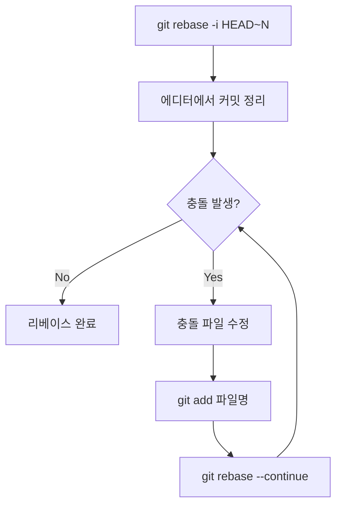

# Git IDE 워크플로우 가이드

VSCode와 CLI를 활용한 Git 워크플로우 가이드. WebStorm GUI에서 전환하는 사용자를 위한 실전 가이드.

## 추천 접근법: 하이브리드 방식

| 작업 | 추천 도구 | 이유 |
|------|----------|------|
| 커밋 히스토리 보기 | Git Graph (GUI) | 시각적 이해 |
| 인터랙티브 리베이스 | GitLens 에디터 (GUI) | 드래그앤드롭 지원 |
| 충돌 해결 | VSCode 내장 3-way | 직관적 UI |
| 커밋/푸시 | CLI | 빠르고 정확 |
| 브랜치 전환 | CLI | 타이핑이 클릭보다 빠름 |

---

## VSCode 설정

### 필수 확장 프로그램

```bash
# GitLens - blame, 히스토리, 리베이스 에디터
code --install-extension eamodio.gitlens

# Git Graph - 브랜치 시각화 (무료)
code --install-extension mhutchie.git-graph
```

### Git 에디터 설정

```bash
# VSCode를 기본 Git 에디터로 설정
git config --global core.editor "code --wait"

# 리베이스 에디터만 VSCode로 설정
git config --global sequence.editor "code --wait"
```

이 설정 후 `git rebase -i` 실행 시 GitLens 리베이스 에디터가 자동으로 열림.

### GitLens 리베이스 에디터 활성화

1. `Cmd+Shift+P` → `GitLens: Enable Interactive Rebase Editor`
2. 또는 설정에서 `gitlens.rebaseEditor.enabled: true`

---

## CLI 리베이스 워크플로우

### 기본 흐름



### Step 1: 인터랙티브 리베이스 시작

```bash
# 최근 3개 커밋 정리
git rebase -i HEAD~3

# main 브랜치 기준으로 리베이스
git rebase -i main

# 원격 main 기준
git fetch origin
git rebase -i origin/main
```

### Step 2: 에디터에서 커밋 액션 선택

```bash
# 에디터가 열리면 각 커밋 앞의 명령어를 변경
pick 1234567 첫 번째 커밋    # 그대로 유지
squash 2345678 두 번째 커밋  # 위 커밋과 합치기
reword 3456789 세 번째 커밋  # 메시지만 수정

# 주요 명령어
# pick (p)   - 커밋 그대로 사용
# reword (r) - 커밋 메시지 수정
# edit (e)   - 커밋 내용 수정 (멈춤)
# squash (s) - 이전 커밋과 합침 (메시지 합침)
# fixup (f)  - 이전 커밋과 합침 (메시지 버림)
# drop (d)   - 커밋 삭제
```

### Step 3: 충돌 발생 시 해결

```bash
# 1. 충돌 파일 확인
git status
# "both modified: src/index.ts" 같은 메시지 표시

# 2. 충돌 파일 열기
code src/index.ts  # VSCode로 열기

# 3. 충돌 마커 해결
# <<<<<<< HEAD
# 현재 브랜치의 내용
# =======
# 리베이스하려는 내용
# >>>>>>> commit-hash

# 4. 원하는 내용만 남기고 마커 삭제

# 5. 해결한 파일 스테이징
git add src/index.ts

# 6. 리베이스 계속
git rebase --continue
```

### Step 4: 리베이스 완료 후 푸시

```bash
# 강제 푸시 (이미 푸시한 브랜치인 경우)
git push --force-with-lease

# 처음 푸시하는 브랜치
git push -u origin feature/branch
```

---

## CLI 충돌 해결 상세 가이드

### 충돌 발생 시 상태 확인

```bash
$ git status
rebase in progress; onto 1234567
You are currently rebasing branch 'feature' on '1234567'.
  (fix conflicts and then run "git rebase --continue")
  (use "git rebase --skip" to skip this patch)
  (use "git rebase --abort" to check out the original branch)

Unmerged paths:
  (use "git add <file>..." to mark resolution)
        both modified:   src/index.ts
        both modified:   src/utils.ts
```

### VSCode에서 충돌 해결

1. `Cmd+Shift+G` (Source Control 열기)
2. "Merge Changes" 섹션에서 충돌 파일 클릭
3. 파일에서 선택:
   - **Accept Current Change**: 내 브랜치 코드 유지
   - **Accept Incoming Change**: 리베이스 대상 코드 사용
   - **Accept Both Changes**: 둘 다 유지
   - **Compare Changes**: 차이점 비교

### mergetool 사용 (고급)

```bash
# VSCode를 merge tool로 설정
git config --global merge.tool vscode
git config --global mergetool.vscode.cmd 'code --wait $MERGED'

# merge tool 실행
git mergetool
```

### 충돌 해결 옵션들

```bash
# 전략적 해결: 내 변경사항으로 통일
git checkout --ours src/index.ts
git add src/index.ts

# 전략적 해결: 상대방 변경사항으로 통일
git checkout --theirs src/index.ts
git add src/index.ts

# 특정 커밋 건너뛰기 (주의!)
git rebase --skip

# 리베이스 완전 취소
git rebase --abort
```

---

## 실전 시나리오

### 시나리오 1: 커밋 정리 후 PR

```bash
# 1. 작업 브랜치에서 여러 커밋 생성
git commit -m "WIP: 기능 추가"
git commit -m "fix typo"
git commit -m "another fix"

# 2. 커밋 정리 (3개를 1개로)
git rebase -i HEAD~3
# 에디터에서:
# pick 첫번째
# squash 두번째
# squash 세번째

# 3. 커밋 메시지 수정
# 에디터가 다시 열림 → 깔끔한 메시지 작성

# 4. 푸시
git push --force-with-lease
```

### 시나리오 2: main 최신화 후 리베이스

```bash
# 1. main 최신화
git fetch origin main

# 2. 현재 브랜치에 main 반영
git rebase origin/main

# 3. 충돌 발생 시 해결
git status
# 파일 수정...
git add .
git rebase --continue

# 4. 푸시
git push --force-with-lease
```

### 시나리오 3: 리베이스 중 실수 복구

```bash
# 리베이스 완전 취소
git rebase --abort

# 이미 완료된 리베이스 되돌리기
git reflog
# 원하는 상태의 HEAD@{n} 찾기
git reset --hard HEAD@{3}

# 또는 ORIG_HEAD 사용
git reset --hard ORIG_HEAD
```

---

## WebStorm vs VSCode 비교

| 기능 | WebStorm | VSCode |
|------|----------|--------|
| **3-way Merge** | 최고 수준, 직관적 UI | 기본 내장, 충분히 좋음 |
| **Git Graph** | 내장, 빠름 | Git Graph 확장 필요 |
| **Interactive Rebase** | 내장 | GitLens 필요 |
| **Blame** | 내장 | GitLens 필요 |
| **가격** | 유료 (비상업적 무료) | 무료 |
| **CLI 통합** | 제한적 | 터미널 내장 |

### WebStorm이 더 나은 점
- 충돌 해결 UI가 더 직관적
- Git 기능이 완전히 통합됨
- 별도 설정 없이 바로 사용

### VSCode가 더 나은 점
- CLI와 자연스럽게 병행 가능
- 터미널이 에디터에 통합
- 확장으로 기능 선택 가능

---

## 유용한 Git 별칭

```bash
# ~/.gitconfig에 추가
[alias]
    # 리베이스 단축
    rb = rebase
    rbi = rebase -i
    rbc = rebase --continue
    rba = rebase --abort

    # 푸시 단축
    pf = push --force-with-lease

    # 상태 확인
    st = status -sb

    # 히스토리 시각화
    lg = log --oneline --graph --all

    # 충돌 파일 목록
    conflicts = diff --name-only --diff-filter=U
```

---

## 참고 자료

- [GitLens VS Marketplace](https://marketplace.visualstudio.com/items?itemName=eamodio.gitlens)
- [Git Graph VS Marketplace](https://marketplace.visualstudio.com/items?itemName=mhutchie.git-graph)
- [GitHub Docs - Resolving merge conflicts](https://docs.github.com/en/get-started/using-git/resolving-merge-conflicts-after-a-git-rebase)
- [GitLab Docs - Rebase and resolve conflicts](https://docs.gitlab.com/topics/git/git_rebase/)
