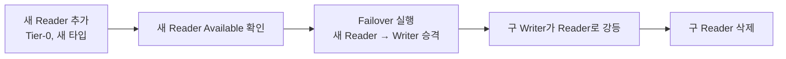

# AWS RDS Aurora Reader 인스턴스 관리

> 작성일: 2026-02-26

## 개요

Aurora 클러스터에서 Reader 인스턴스를 추가, 페일오버, 삭제하는 절차 정리.
2025-2026년 기준 AWS 콘솔 UI 기준.

## 1. Reader 인스턴스 추가 (Add Reader)

### 메뉴 경로

```
AWS Console → RDS → Databases
→ 대상 클러스터 선택 (Regional cluster 행, 인스턴스 행 아님)
→ Actions 버튼 → "Add reader"
```

> [!warning] 선행 조건
> - 클러스터와 Writer 인스턴스가 모두 **Available** 상태여야 함
> - Creating/Modifying 등 전환 상태이면 추가 불가

### Add Reader 페이지 설정 항목

#### DB instance identifier
- 이 Reader 인스턴스의 **고유 이름**
- AWS Region 내에서 중복 불가
- 규칙: 1~63자, 영문+숫자+하이픈, 첫 글자는 영문, 하이픈으로 끝나거나 연속 하이픈 불가
- 예시 명명 패턴: `{클러스터명}-reader-1`, `{서비스명}-aurora-reader-{환경}`
- 이 값이 DNS 엔드포인트에 포함됨: `{identifier}.xxxx.{region}.rds.amazonaws.com`

#### Instance class
- DB 처리 능력과 메모리를 결정하는 인스턴스 타입
- 드롭다운에서 선택 (Standard, Memory Optimized, Burstable 카테고리로 구분)
- `db.r5.8xlarge`: Intel 기반, 범용적으로 검증된 타입
- `db.r6g.8xlarge`: AWS Graviton2 (ARM 기반), 동급 대비 약 20% 비용 절감
- Writer 인스턴스와 동일한 타입 권장 (페일오버 시 성능 동일하게 유지)

#### Additional configuration → Failover priority
- **Tier 0 ~ Tier 15** 중 선택 (0이 최우선)
- 기본값: Tier 1
- Writer 장애 시 가장 낮은 Tier 번호의 Reader가 우선 승격
- 동일 Tier 내에서는 **더 큰 인스턴스**가 우선 승격
- 새로 추가하는 Reader를 다음 Writer 후보로 쓰려면 **Tier 0** 설정

#### 기타 설정
| 항목 | 설명 |
|------|------|
| Availability Zone | 특정 AZ 지정 (권장: Writer와 다른 AZ) |
| Publicly accessible | 일반적으로 No |
| DB parameter group | 기본값 또는 커스텀 그룹 |
| Performance Insights | 기본 활성화 |
| Enhanced monitoring | OS 메트릭 수집 (선택) |
| Auto minor version upgrade | 자동 마이너 버전 업 여부 |

### 생성 완료

설정 후 하단 **"Add reader"** 버튼 클릭 → 상태가 `Creating` → `Available`로 변경됨

---

## 2. 페일오버 (Failover)

### 목적

- 새로 추가한 Reader를 Writer로 승격시킬 때
- 구형 Writer 인스턴스 타입 교체 시 (새 Reader 추가 → 페일오버 → 구 Writer 삭제)

### 절차

```
RDS → Databases
→ 페일오버할 클러스터의 Writer 인스턴스 선택 (인스턴스 행)
→ Actions → "Failover"
→ 확인 팝업에서 "Failover" 클릭
```

> [!note] 동작 방식
> - 가장 낮은 Tier 번호의 Reader가 새 Writer로 승격
> - 클러스터 상태: `Available` → `Failing-over` → `Available`
> - 완료까지 보통 **60초 이내**
> - 클러스터 엔드포인트는 자동으로 새 Writer를 가리킴

### CLI로 특정 인스턴스 지정 페일오버

```bash
aws rds failover-db-cluster \
    --db-cluster-identifier {cluster-id} \
    --target-db-instance-identifier {target-reader-id}
```

---

## 3. 인스턴스 삭제 (Delete)

### Reader 인스턴스 단독 삭제

```
RDS → Databases
→ 삭제할 인스턴스 행 선택 (체크박스)
→ Actions → "Delete"
→ 확인 텍스트 "delete me" 입력
→ "Delete" 클릭
```

> [!warning] 삭제 순서 주의
> Writer를 먼저 삭제하면 자동 페일오버가 발생함.
> 순서: **Reader 먼저 삭제 → Writer 삭제 → 클러스터 삭제**

### 클러스터 전체 삭제

```
RDS → Databases
→ 클러스터 행 선택
→ Actions → "Delete"
→ 최종 스냅샷 생성 여부 선택
→ "delete me" 입력 → Delete
```

> [!note] Deletion Protection 활성화된 경우
> 클러스터 수정(Modify)에서 Deletion protection을 먼저 비활성화해야 함

---

## 인스턴스 교체 시나리오 (타입 업그레이드)

기존 Writer를 더 큰 인스턴스로 교체하는 전형적인 절차:



1. 원하는 인스턴스 타입으로 새 Reader 추가 (Failover priority: Tier-0)
2. 새 Reader 상태 `Available` 확인
3. 페일오버 실행 → 새 Reader가 Writer로 승격
4. 구 Writer는 자동으로 Reader로 전환됨
5. 구 Reader 인스턴스 삭제

---

## 참고

- [Aurora Replica 추가 공식 문서](https://docs.aws.amazon.com/AmazonRDS/latest/AuroraUserGuide/aurora-replicas-adding.html)
- [Aurora 페일오버 공식 문서](https://docs.aws.amazon.com/AmazonRDS/latest/AuroraUserGuide/aurora-failover.html)
- [Aurora 인스턴스 삭제 공식 문서](https://docs.aws.amazon.com/AmazonRDS/latest/AuroraUserGuide/USER_DeleteCluster.html)
- [Failover Priority 상세](https://aws.amazon.com/blogs/aws/additional-failover-control-for-amazon-aurora/)
- [Aurora Failover 실전 가이드 - DEV Community](https://dev.to/aws-builders/doing-failover-in-amazon-aurora-read-replica-with-the-highest-priority-4okb)

#topic/infra #topic/aws #topic/database
