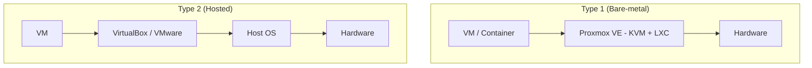
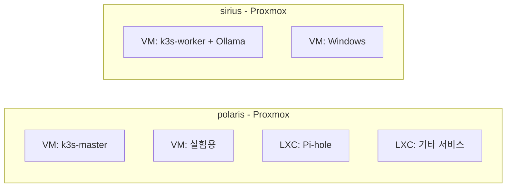
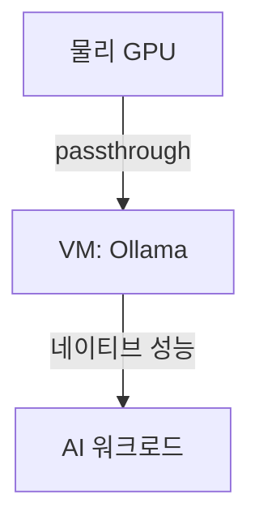
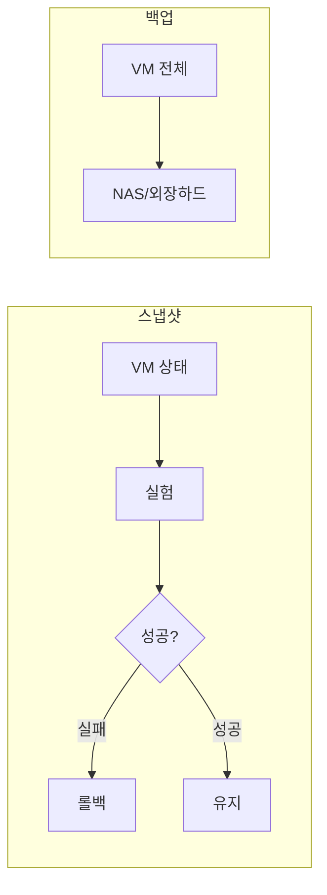
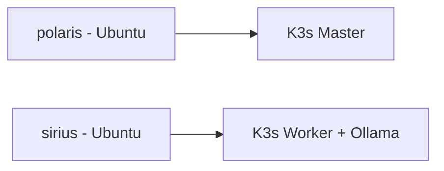
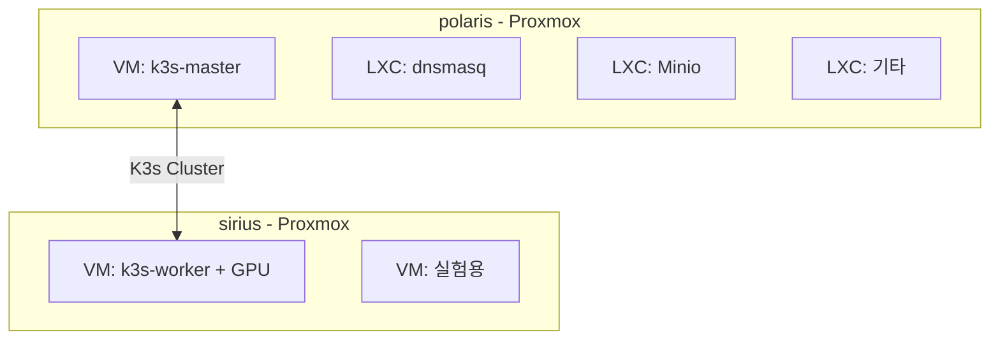

---
tags:
  - type/reference
  - topic/infra
---

# Proxmox VE

> 홈랩/홈서버를 위한 오픈소스 가상화 플랫폼

## 개요

**Proxmox VE (Virtual Environment)** 는 Debian 기반의 서버 가상화 관리 플랫폼이다. 엔터프라이즈급 기능을 무료로 제공하며, 홈랩 커뮤니티에서 가장 많이 사용되는 하이퍼바이저 중 하나다.

## 핵심 개념

### Type 1 Hypervisor (Bare-metal)



- **Type 1**: 하드웨어 위에 직접 설치 (Proxmox, ESXi, Hyper-V Server)
- **Type 2**: OS 위에 설치 (VirtualBox, VMware Workstation)

**Type 1이 더 빠른 이유**: 호스트 OS 없이 하드웨어 직접 접근

### KVM vs LXC

| 기술 | 용도 | 격리 수준 | 오버헤드 |
|-----|------|----------|---------|
| **KVM** (VM) | 완전한 가상 머신 | 높음 | 5-10% |
| **LXC** (Container) | 리눅스 컨테이너 | 중간 | 거의 없음 |

- **KVM**: 다른 OS 설치 가능 (Windows, 다른 Linux 배포판)
- **LXC**: Linux만, 커널 공유, 가벼움 (Docker와 비슷하지만 시스템 컨테이너)

## Proxmox를 선택한 이유

### 1. 유연성



- VM 자유롭게 생성/삭제/복제
- 실험하다 망해도 VM만 날리면 됨
- 나중에 새 서비스 추가 쉬움

### 2. 웹 UI 관리

```
https://192.168.0.x:8006
```

- 브라우저로 모든 관리 가능
- 콘솔 접속, 스냅샷, 백업 등
- 모니터 연결 불필요

### 3. 클러스터링


- 여러 노드를 하나의 클러스터로 관리
- VM 라이브 마이그레이션 가능
- 고가용성 설정 가능

### 4. GPU Passthrough



- VM에 GPU 직접 할당
- AI/ML 워크로드에 필수
- 게이밍 VM도 가능

### 5. 스냅샷 & 백업



### 6. 무료 + 오픈소스

- 엔터프라이즈 기능 전부 무료
- 유료는 기술 지원만
- 커뮤니티 활발

## 베어메탈 vs Proxmox 비교

| 항목 | 베어메탈 (Ubuntu 직접) | Proxmox + VM |
|-----|----------------------|--------------|
| **성능** | 100% | 90-95% |
| **유연성** | 낮음 | 높음 |
| **복구** | 재설치 필요 | 스냅샷 롤백 |
| **실험** | 위험 | 안전 |
| **관리** | SSH | 웹 UI + SSH |
| **GPU** | 직접 사용 | Passthrough |
| **Windows** | 불가 | VM으로 가능 |

## 아키텍처 (변경)

### 기존 계획



### 새 계획



## 설치

### 준비물

- Proxmox VE ISO: https://www.proxmox.com/en/downloads
- USB 8GB 이상
- balenaEtcher

### 설치 과정

1. USB에 ISO 굽기 (balenaEtcher)
2. USB 부팅
3. 설치 (5분)
   - 디스크 선택
   - 국가/시간대
   - 비밀번호
   - 네트워크 설정 (고정 IP 권장)
4. 재부팅 → `https://IP:8006` 접속

### 설치 후 설정

```bash
# 무료 저장소 활성화 (구독 없이 사용)
# /etc/apt/sources.list.d/pve-enterprise.list 비활성화
# pve-no-subscription 저장소 추가
```

## 참고

- [[VIRTUALIZATION]] - 가상화 개념
- [[개인/PROJECT_HOME-INFRA/SETUP/02-PROXMOX|Proxmox 설치 가이드]]
- [[개인/PROJECT_HOME-INFRA/README|HOME-INFRA 프로젝트]]

## 외부 자료

- [Proxmox 공식 문서](https://pve.proxmox.com/pve-docs/)
- [Proxmox 위키](https://pve.proxmox.com/wiki/)
- [r/homelab](https://reddit.com/r/homelab) - 홈랩 커뮤니티

---

#proxmox #virtualization #homelab
