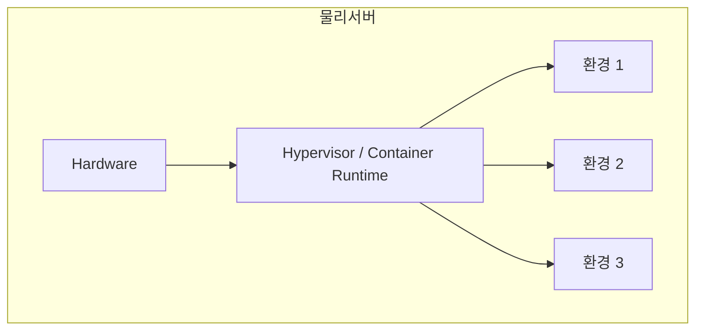
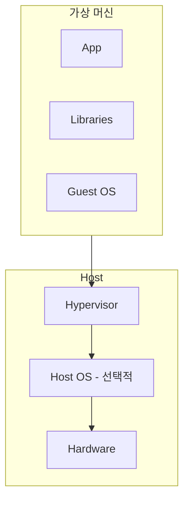
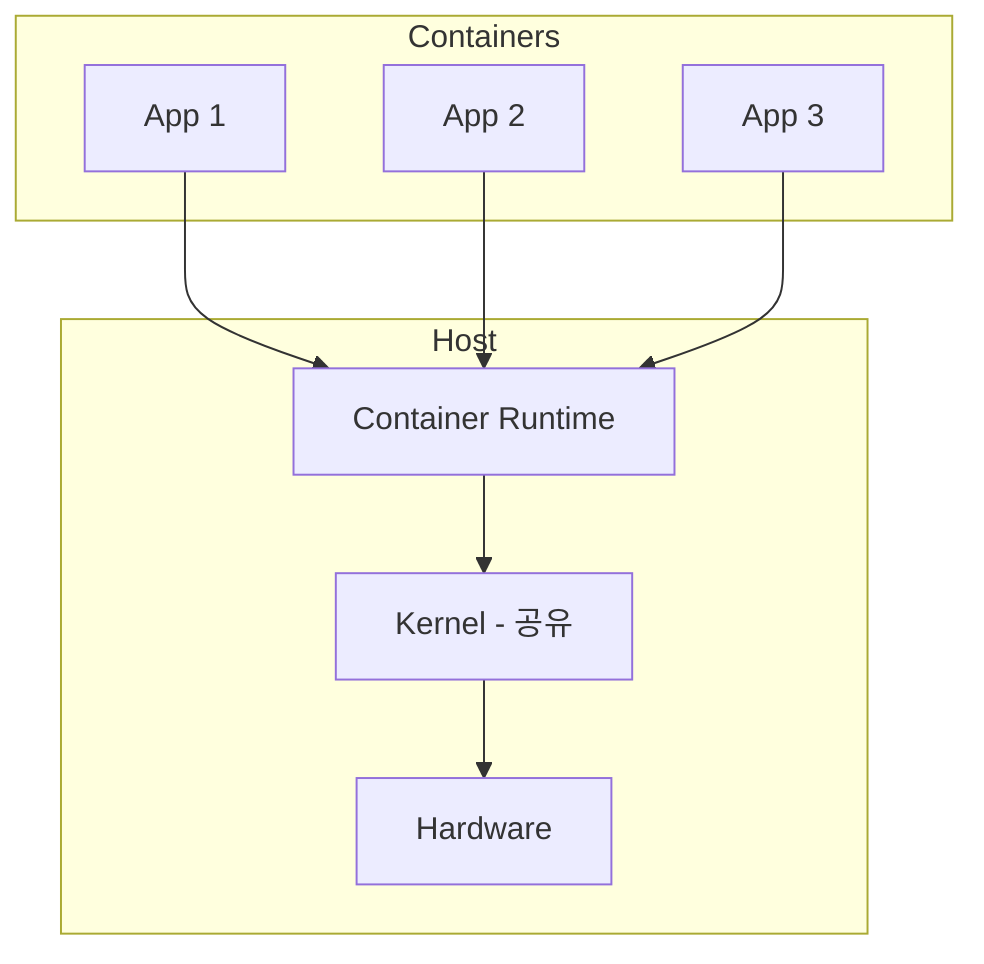
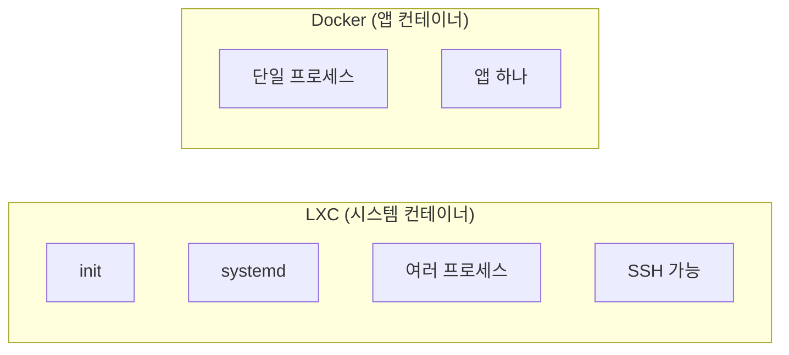
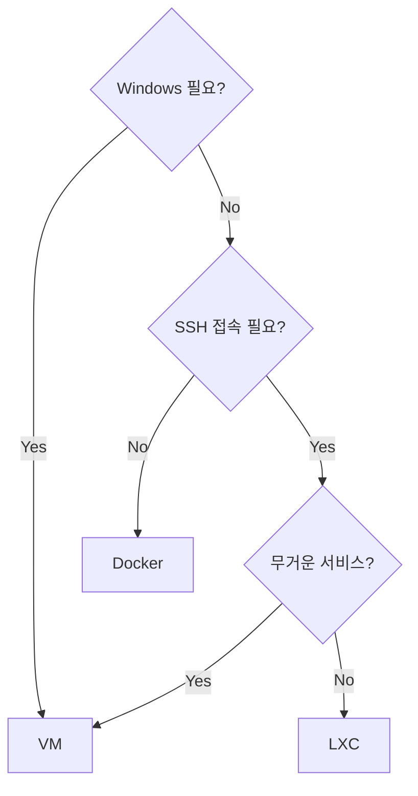
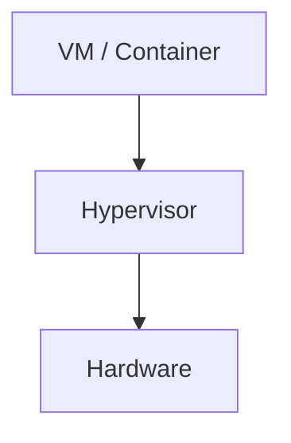
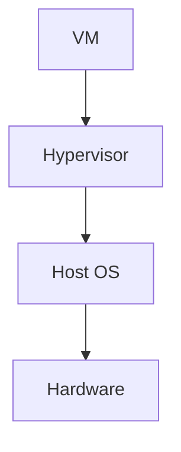
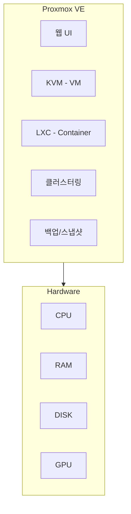
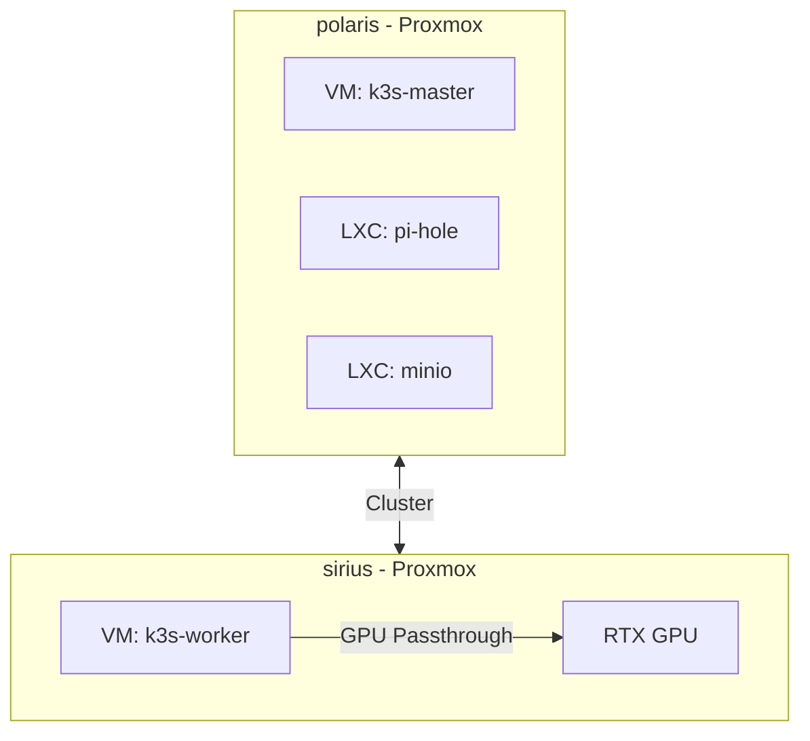

# 가상화 개념 가이드

> 홈랩을 위한 가상화 기술 이해

## 가상화란?

하나의 물리 서버에서 여러 개의 독립된 환경을 실행하는 기술

## 가상화 종류

### 1. VM (Virtual Machine)

**특징:**
- 완전한 OS 포함 (커널 별도)
- 높은 격리 수준
- 무거움 (GB 단위)
- 부팅 시간 분 단위

**용도:**
- Windows 실행
- 다른 Linux 배포판
- 완전한 격리 필요 시

### 2. Container

**특징:**
- 커널 공유
- 가벼움 (MB 단위)
- 즉시 시작
- Linux만 가능 (커널 공유)

## 컨테이너 종류: LXC vs Docker

| 항목 | LXC | Docker |
|-----|-----|--------|
| **목적** | 가벼운 VM처럼 사용 | 앱 패키징/배포 |
| **프로세스** | 여러 개 (systemd) | 보통 1개 |
| **SSH** | 가능 | 보통 안 함 |
| **용량** | 수백 MB | 수십~수백 MB |
| **용도** | Pi-hole, DNS 서버 | 웹앱, API 서버 |
| **이미지** | 배포판 기반 | 앱 기반 |

### 언제 뭘 쓸까?

| 상황 | 선택 |
|-----|------|
| Windows 설치 | **VM** |
| GPU 사용 (Ollama) | **VM** (passthrough) |
| Pi-hole, DNS | **LXC** |
| 웹앱, API | **Docker** |
| K3s 노드 | **VM** (안정성) |
| 간단한 서비스 | **LXC** |

## Hypervisor 종류

### Type 1 (Bare-metal)

- 하드웨어에 직접 설치
- **Proxmox**, ESXi, Hyper-V Server
- 성능 좋음

### Type 2 (Hosted)

- OS 위에 설치
- VirtualBox, VMware Workstation
- 데스크탑용

## Proxmox가 제공하는 것

| 기능 | 설명 |
|-----|------|
| **KVM** | 완전한 VM 지원 |
| **LXC** | 시스템 컨테이너 |
| **웹 UI** | 브라우저로 관리 |
| **클러스터** | 여러 노드 통합 관리 |
| **스냅샷** | 즉시 상태 저장 |
| **백업** | 정기 백업 스케줄 |
| **마이그레이션** | VM/LXC 노드 간 이동 |
| **GPU Passthrough** | VM에 GPU 직접 할당 |

## 우리 구성 예시

---

## 참고

- [[PROXMOX]] - Proxmox 상세
- [[개인/PROJECT_HOME-INFRA/SETUP/02-PROXMOX|Proxmox 설치 가이드]]
- [[개인/PROJECT_HOME-INFRA/README|HOME-INFRA 프로젝트]]

---

#virtualization #homelab #proxmox
