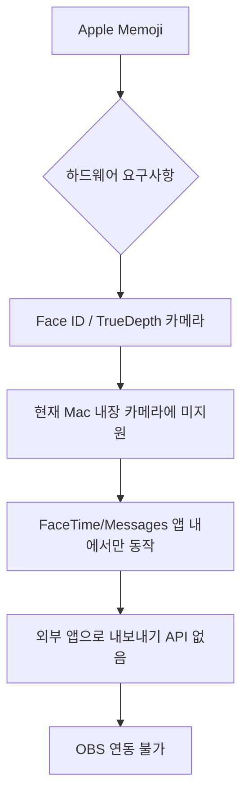

# Mac Memoji/아바타 가상 카메라 (OBS 연동)

> 작성일: 2026-03-28

## 개요

Mac에서 Memoji 스타일 아바타 + 얼굴 추적으로 가상 카메라를 만들어 OBS에 연동하는 방법 정리. 2025-2026년 기준 현재 작동하는 솔루션만 포함.

---

## 결론

Memoji 자체를 OBS에 쓰는 공식 방법은 없음. Apple의 Memoji는 Face ID(TrueDepth 카메라) 하드웨어 종속이라 일반 맥 웹캠으로 구동 불가. 대신 **유사한 카툰 아바타 + 얼굴 추적** 솔루션으로 대체 가능.

> [!warning] Snap Camera는 2023년 1월 25일 공식 종료
> 공식 앱은 동작 불가. 커뮤니티 자구책(snap-camera-server)은 존재하나 불안정.

---

## 옵션 비교표

| 앱 | 플랫폼 | 아바타 형식 | OBS 연동 | 가격 | 상태 |
|----|--------|-----------|---------|------|------|
| **VCam** | macOS 전용 | VRM(3D), Live2D(2D) | 직접 가상 카메라 | 유료 | 활발히 개발 중 |
| **VTube Studio** | Mac/Win/iOS/Android | Live2D 전용 | OBS Window Capture | 무료(워터마크) / DLC $20 | 활발히 개발 중 |
| **veadotube mini** | Mac/Win/Linux | PNG(2D) | OBS Window Capture | 무료 | 활발히 개발 중 |
| **VSeeFace** | Windows 전용 | VRM(3D) | 가상 카메라/Spout2 | 무료 | Mac 미지원 (Wine 우회 가능) |
| **FilterOnMe** | Mac/Win | 얼굴 필터/효과 | 가상 카메라 출력 | 유료 구독 | 운영 중 |
| **Snap Camera** | Mac/Win | Snapchat 렌즈 | 가상 카메라 출력 | 무료 | **2023년 종료** |
| **Snapchat Camera for Chrome** | Chrome 확장 | Snapchat 렌즈 | OBS Browser Source | 무료 | 2024년 출시, 현재 운영 |

---

## 세부 솔루션

### 1. VCam (추천 - macOS 특화)

**가장 Mac에 최적화된 선택지.**

- macOS 전용 앱으로 CoreMedia I/O 가상 카메라 사용
- VRM(3D) 및 Live2D(2D) 모델 지원
- 얼굴, 손, 손가락 추적 지원
- OBS에서 카메라 장치로 직접 선택 가능 (별도 캡처 불필요)
- iFacialMocap, VCamMocap 등 외부 앱 연동 가능
- M1 Mac에서 일부 기능 지연 보고 있음, CPU 사용량 높음

```
공식: https://vcamapp.com/en
GitHub: https://github.com/vcamapp/app
OBS 연동 가이드: https://docs.vcamapp.com/en/integration/obs
```

### 2. VTube Studio (Steam)

- Mac/Win/iOS/Android 지원
- Live2D 모델만 지원 (VRM 미지원)
- 웹캠 기반 얼굴 추적 (OpenSeeFace 내장) 또는 iPhone/Android로 추적
- OBS에서 Window Capture로 투명 배경 캡처 후 가상 카메라 출력
- 워터마크 제거 DLC 약 $20

```
Steam: https://store.steampowered.com/app/1325860/VTube_Studio/
공식: https://denchisoft.com/
```

### 3. veadotube mini (무료, 간단)

- PNG 기반 2D 아바타 (Live2D보다 제작 쉬움)
- 얼굴 추적으로 표정 전환 (OpenSeeFace 기반)
- OBS Window Capture + 투명 배경 → 가상 카메라 출력
- 완전 무료, Mac/Win/Linux 지원
- 현재 버전 2.2

```
공식: https://veado.tube/
itch.io: https://olmewe.itch.io/veadotube-mini
OBS 연동: https://veado.tube/docs/usage/obs/
```

### 4. Snapchat Camera for Chrome (Snap Camera 후속)

- Snap Camera 종료 후 2024년 5월 Snapchat이 출시한 공식 후속
- Chrome 확장으로 Snapchat AR 렌즈 사용 가능
- OBS에서 Browser Source로 사용하거나 별도 앱으로 가상 카메라 출력
- Memoji와 유사한 카툰 아바타 렌즈 있음

> [!note] 기존 Snap Camera 부활 시도
> `snap-camera-server` (GitHub)로 셀프 호스팅 가능하나 불안정함

### 5. OBS obs-face-tracker 플러그인

**아바타 기능 없음** - 카메라 프레이밍 자동화용.
- 얼굴을 감지해 카메라 크롭/이동을 자동으로 조정
- Mac Apple Silicon (arm64) 지원
- 아바타 대체가 아니라 카메라 추적 보조 도구

```
GitHub: https://github.com/norihiro/obs-face-tracker
Mac 설치: https://github.com/norihiro/obs-face-tracker/wiki/Install-MacOS
```

---

## Memoji를 OBS에 쓰는 방법이 없는 이유



Apple Memoji는 Face ID 하드웨어 의존적이며, 외부 앱으로의 가상 카메라 출력 API가 존재하지 않음. macOS Sonoma 이후에도 이 제약은 유지됨.

---

## macOS 네이티브 기능 활용

### Continuity Camera (iPhone을 Mac 웹캠으로)

- iOS 16 + macOS Ventura 이상 필요
- iPhone을 Mac 웹캠으로 자동 인식
- Center Stage, Portrait Mode, Studio Light, Desk View 제공
- OBS에서 카메라 소스로 직접 사용 가능
- **단, Memoji는 iPhone의 FaceTime/Messages 안에서만 동작 - OBS로 직접 내보내기 불가**

### FaceTime/Messages의 Memoji

- Mac에서 FaceTime 통화 중 Memoji 사용 가능 (macOS Monterey+)
- 화면 녹화(QuickTime)로 캡처 후 OBS에 미디어 소스로 넣는 방식 가능하나 품질/지연 문제 있음

---

## 권장 워크플로우


**가장 빠른 셋업:**
1. VTube Studio (Steam, 무료) 설치
2. Live2D 모델 준비 (VTuber 커뮤니티에서 무료 모델 다수 제공)
3. OBS에서 Game/Window Capture → VTube Studio 창 캡처
4. OBS 가상 카메라 시작

**Mac 특화 + 고품질:**
1. VCam 구매
2. VRM 모델 준비 (VRoid Studio로 제작 가능, 무료)
3. OBS에서 VCam을 카메라 소스로 직접 선택

---

## 참고

- [VCam 공식](https://vcamapp.com/en)
- [VTube Studio Steam](https://store.steampowered.com/app/1325860/VTube_Studio/)
- [veadotube mini](https://veado.tube/)
- [Snap Camera 종료 기사 - TechCrunch](https://techcrunch.com/2023/01/05/snap-is-shutting-down-its-desktop-camera-app-that-allows-users-to-apply-filters-during-video-calls/)
- [snap-camera-server (커뮤니티 자구책)](https://github.com/ptrumpis/snap-camera-server)
- [obs-face-tracker 플러그인](https://github.com/norihiro/obs-face-tracker)
- [OBS 가상 카메라 공식 가이드](https://obsproject.com/kb/virtual-camera-guide)

#topic/obs #topic/streaming #topic/avatar #type/concept
